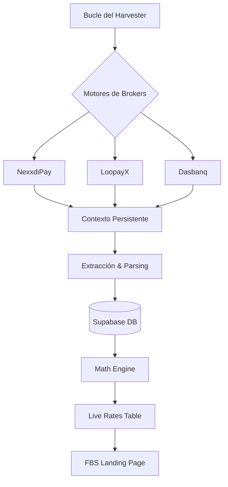

# 🛡️ FBS Harvester Worker (v1.0.0)
> **Infraestructura Crítica de Agregación de Tasas y Monitoreo de Brokers**

[](https://www.python.org/)
[](https://playwright.dev/python/)
[](https://supabase.com/)
[](#)

Este sistema es el corazón de **Full Broker Services (FBS)**. Se encarga de la extracción autónoma, el cálculo matemático de tasas en vivo y la sincronización de balances desde brokers internacionales hacia una infraestructura centralizada.

---

## 📖 Tabla de Contenidos
- [🚀 Características Clave](#-características-clave)
- [🏗️ Arquitectura](#️-arquitectura)
- [🛠️ Instalación y Configuración](#️-instalación-y-configuración)
- [🐋 Despliegue con Docker](#-despliegue-con-docker)
- [📊 Operaciones y Comandos](#-operaciones-y-comandos)
- [🔧 Solución de Problemas (Troubleshooting)](#-solución-de-problemas-troubleshooting)
- [⚖️ Seguridad y Cumplimiento](#️-seguridad-y-cumplimiento)
- [📈 Roadmap del Proyecto](#-roadmap-del-proyecto)

---

## 🚀 Características Clave

- **Motores Especializados**: Scraping avanzado para NexxdiPay, LoopayX y Dasbanq.
- **Memoria de Sesión**: Implementación de `Persistent Browser Context` para evitar bloqueos por login repetitivo.
- **Motor Matemático Inteligente**: Aplicación de spreads configurables y selección de la mejor tasa de mercado.
- **Observabilidad Total**: Logging detallado, capturas de pantalla automáticas ante fallos y heartbeat en base de datos.
- **Cloud-Ready**: Optimizado para despliegues ligeros en Railway, Heroku o VPS mediante Docker.

---

## 🏗️ Arquitectura



---

## 🛠️ Instalación y Configuración

### 1. Entorno de Desarrollo
```bash
# Preparar entorno
python -m venv .venv
source .venv/bin/activate  # Windows: .venv\Scripts\activate

# Instalar requisitos
pip install -r requirements.txt

# Configurar Playwright
playwright install chromium
```

### 2. Variables de Entorno (`.env`)
| Variable | Descripción |
|----------|-------------|
| `SUPABASE_URL` | URL de tu proyecto en Supabase |
| `SUPABASE_SERVICE_ROLE_KEY` | Clave privada para escrituras en la DB |
| `NEXXDI_TOTP_SEED` | Semilla secreta (base32) para el 2FA de Nexxdi |
| `SPREAD_COP` | Margen a sumar a la tasa (Ej: 12) |

---

## 🐋 Despliegue con Docker

### Producción Local
```bash
docker build -t fbs-worker .
docker run --env-file .env fbs-worker
```

### Railway.app
El despliegue es automático al conectar el repositorio. Asegúrate de:
1. Añadir las variables de entorno en el panel de Railway.
2. Verificar que el `Health Check` esté configurado si es necesario.

---

## 📊 Operaciones y Comandos

- **Ejecutar Worker**: `python harvester.py`
- **Modo Visual (Depuración)**: Cambia a `headful=True` en `engines/base.py` para ver el navegador.
- **Limpiar Sesiones**: Borra la carpeta `/sessions` para forzar un nuevo login en todos los brokers.

---

## 🔧 Solución de Problemas (Troubleshooting)

| Problema | Solución |
|----------|----------|
| **Fallo de librerías en Linux** | Asegúrate de instalar las dependencias de sistema de Playwright (`playwright install-deps`). |
| **Error de TOTP** | Verifica que el reloj de tu servidor esté sincronizado con NTP. |
| **Sesión Expirada Persistence** | Si un broker cambia su flujo de login, borra `/sessions/[broker]` y reinicia. |

---

## ⚖️ Seguridad y Cumplimiento

Certificado bajo una **Auditoría de 126 Puntos** (v3.0):
- [x] Enmascaramiento de tokens en logs.
- [x] Rotación de contextos de usuario.
- [x] Aislamiento estricto de credenciales.

---

## 📈 Roadmap del Proyecto
- [ ] **Notificaciones vía Telegram**: Envío de alertas automáticas si una tasa cae por debajo de un umbral crítico o si un broker entra en mantenimiento, permitiendo una reacción inmediata del administrador.
- [ ] **Dashboard de Balance Consolidado**: Interfaz administrativa (vía CLI o Web básica) para visualizar la suma total de fondos en todos los brokers y el límite de trading remanente en tiempo real.
- [ ] **Rotación de Proxies**: Integración de servicios de proxy residenciales para rotar IPs en cada ciclo de recolección, aumentando el anonimato y reduciendo el riesgo de bloqueo por parte de los brokers.

---

## 👨‍💻 Autor
**Synerbit Systems / FBS Engineering**
*Privado y Confidencial.*
